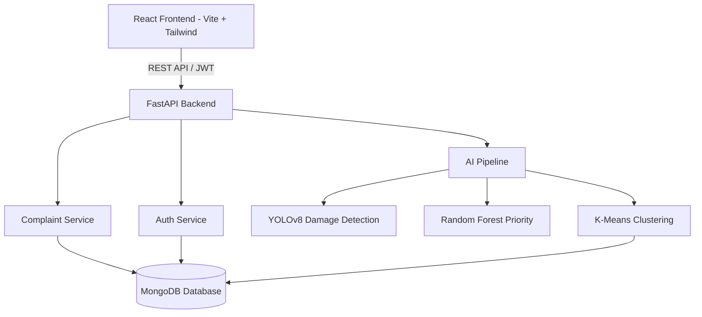
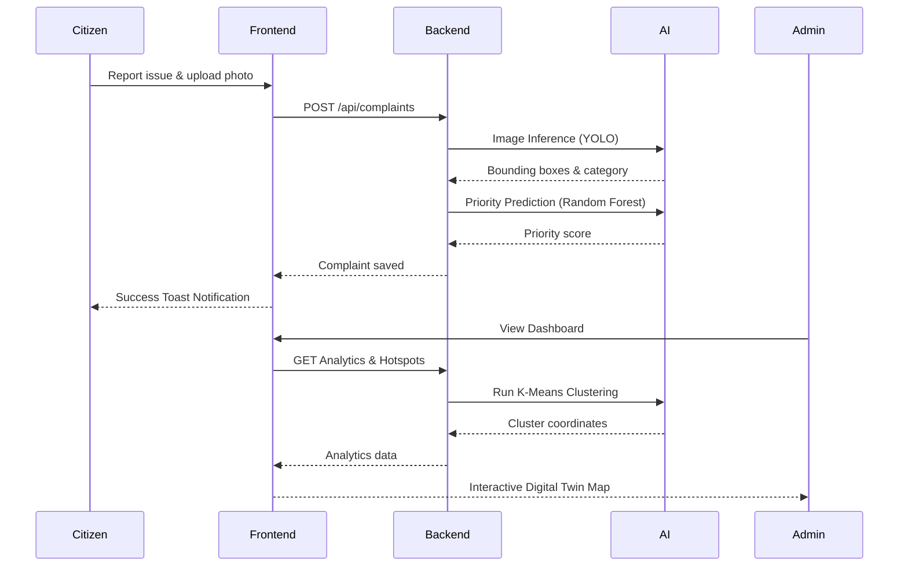
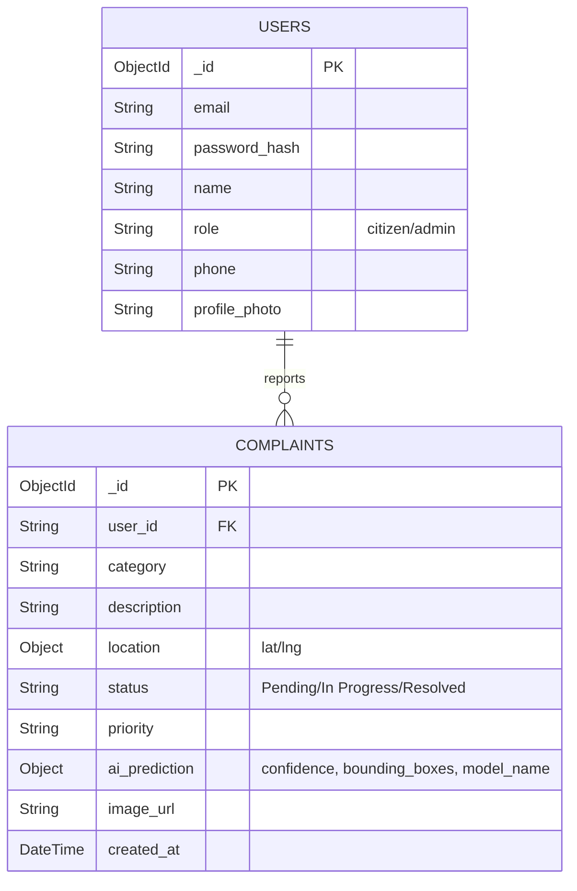
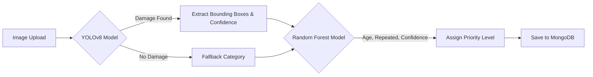
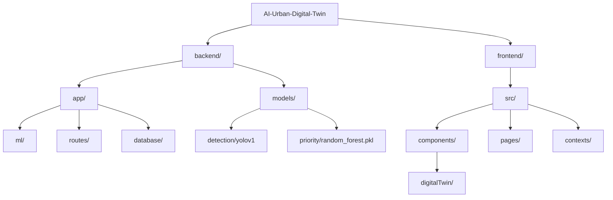

# UrbanMind AI
**AI-Powered Urban Digital Twin for Civic Issue Prediction and Smart Complaint Management**

## Project Overview
UrbanMind AI is a comprehensive, production-ready civic technology platform that transforms how municipalities manage public infrastructure issues. It empowers citizens to report issues like potholes or structural damage via a seamless interface and provides city administrators with a powerful AI-driven digital twin dashboard to triage, analyze, and resolve complaints efficiently.

## Authors
- UrbanMind AI Engineering Team

## License
MIT License

## Key Capabilities
- YOLOv8 road/civic issue detection
- Random Forest priority prediction
- K-Means hotspot clustering
- Explainable AI priority factors
- AI-assisted recommended action
- Duplicate complaint detection
- Area-wise analytics
- Before-vs-after hotspot analysis
- Digital Twin visualization
- Notifications
- CSV/PDF exports
- Profile management
- Security and role-based access

---

## 1. Architecture Diagram


## 2. System Flow Diagram


## 3. Database ER Diagram (MongoDB Collections)


## 4. AI Workflow Diagram


## 5. Folder Structure Diagram


---

## Installation & Deployment Guide

### Prerequisites
- Node.js (v18+)
- Python (3.10+)
- MongoDB Community Server (Running on `localhost:27017`)

### Backend Setup
```bash
cd backend
python -m venv venv
# Windows: venv\Scripts\activate
# Mac/Linux: source venv/bin/activate
pip install -r requirements.txt
cp .env.example .env
uvicorn app.main:app --reload --port 8005
```

### Frontend Setup
```bash
cd frontend
npm install
npm run dev
```

### Production Build
```bash
cd frontend
npm run build
# Dist folder will be generated for static hosting (e.g. Nginx, Vercel)
```

## Known Limitations
- The PDF Export functionality relies on client-side browser memory (`jspdf`). Extremely large datasets (>10,000 rows) may cause memory issues on lower-end devices.
- YOLO inference runs on CPU by default. For production deployments with high traffic, a GPU-enabled PyTorch environment is recommended.
- Current K-Means clustering does not factor in time-decay.

## Future Scope
- **Time-Series Hotspots**: Upgrade clustering to factor in the resolution time of complaints, letting clusters naturally dissipate as issues are fixed.
- **GPU Acceleration**: Deploy YOLOv8 with TensorRT or ONNX for real-time edge processing.
- **Push Notifications**: Integrate Firebase Cloud Messaging (FCM) or WebSockets for real-time admin alerts.
